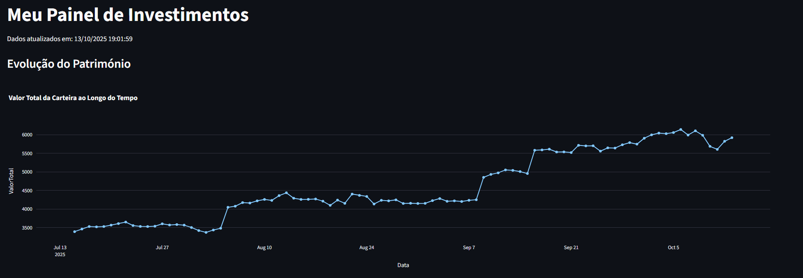
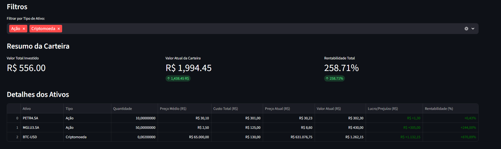
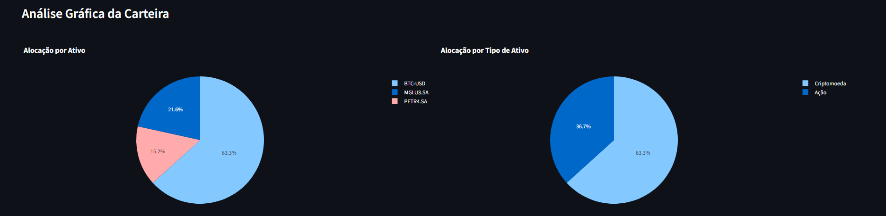
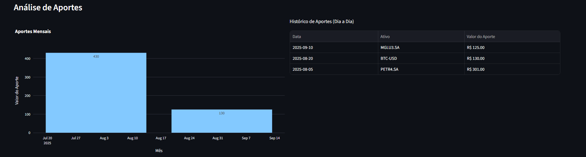
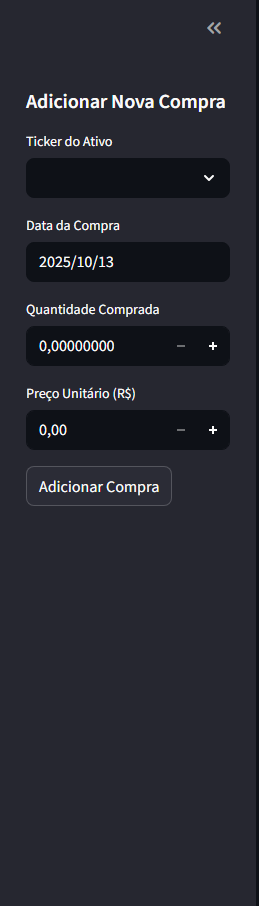

# Painel de Acompanhamento de Carteira de Investimentos

Este projeto é uma aplicação web, construída com Python e Streamlit, para acompanhamento de uma carteira de investimentos diversificada, incluindo ações, ETFs e criptomoedas. A aplicação foi desenvolvida para ser uma ferramenta similar ao Kinvo, focada em dar visibilidade sobre a evolução do património e a performance dos ativos.

## Funcionalidades Principais

- **Dashboard Interativo:** Interface web limpa e moderna para visualização dos dados.
- **Múltiplos Tipos de Ativos:** Suporte para Ações e ETFs da B3, além de Criptomoedas.
- **Análise de Performance:** Cálculo em tempo real de preço médio, custo total, valor atual, lucro/prejuízo e rentabilidade de cada ativo e da carteira consolidada.
- **Gráficos Dinâmicos:**
  - **Evolução do Património:** Gráfico de linha que mostra o valor total da carteira ao longo do tempo.
  - **Alocação de Ativos:** Gráficos de pizza interativos para visualizar a distribuição da carteira por ativo e por tipo de ativo.
  - **Histórico de Aportes:** Gráfico de barras com o total investido a cada mês.
- **Entrada de Dados Facilitada:** Formulário na barra lateral para adicionar novas transações de compra sem precisar de editar ficheiros manualmente.
- **Atualização Automática de Ativos:** Inclui um script auxiliar que busca e atualiza automaticamente a lista de todas as ações da B3 e as 250 principais criptomoedas do mercado.

## Estrutura do Projeto

- `app.py`: A aplicação web principal construída com Streamlit. É o ficheiro que se executa para visualizar o painel.
- `carteira.json`: Onde são armazenadas todas as transações de compra do utilizador. **Este é o principal ficheiro de dados do utilizador.**
- `update_tickers.py`: Script utilitário para fazer web scraping e chamadas de API para gerar a lista completa de ativos disponíveis.
- `backfill_historico.py`: Script utilitário para popular o histórico de valor da carteira com dados de dias passados.
- `all_tickers.json`: Ficheiro gerado pelo `update_tickers.py` com a lista de todos os tickers.
- `historico_portfolio.csv`: Ficheiro gerado pela aplicação que guarda o valor total da carteira a cada dia.
- `requirements.txt`: Lista de todas as bibliotecas Python necessárias para o projeto.

## Configuração e Instalação

1.  **Clone o repositório** (ou descarregue os ficheiros para uma pasta).
2.  **(Opcional, mas recomendado)** Crie e ative um ambiente virtual:
    ```bash
    python -m venv venv
    source venv/bin/activate  # No Windows: venv\Scripts\activate
    ```
3.  **Instale as dependências:**
    ```bash
    pip install -r requirements.txt
    ```

## Como Usar a Aplicação

O uso da aplicação é dividido em duas partes: a atualização da base de dados e a execução do painel.

1.  **(Opcional) Atualizar a Lista de Ativos:**
    Execute este comando sempre que quiser buscar a lista mais recente de ações e criptomoedas (ex: uma vez por mês).
    ```bash
    python update_tickers.py
    ```

2.  **(Opcional) Preencher o Histórico:**
    Se quiser (re)calcular o gráfico de evolução com os dados dos últimos 90 dias, execute:
    ```bash
    python backfill_historico.py
    ```

3.  **Executar o Painel Principal:**
    Para iniciar e visualizar a sua aplicação, execute:
    ```bash
    streamlit run app.py
    ```
    A aplicação abrirá automaticamente no seu navegador. Para adicionar novas compras, use o formulário na barra lateral.

    ## Demonstração Visual

A aplicação oferece uma visão completa e detalhada da carteira de investimentos.

### Painel Principal
O dashboard principal apresenta um resumo consolidado da carteira, a evolução do património ao longo do tempo e filtros interativos.



### Detalhes dos Ativos
Uma tabela detalhada mostra a performance de cada ativo individualmente, com métricas de rentabilidade e valores atualizados em tempo real.



### Análise Gráfica
Gráficos de pizza interativos permitem visualizar a alocação da carteira por cada ativo e também por tipo de ativo (Ações, ETFs, Criptomoedas).



### Análise de Aportes
A secção de aportes exibe um gráfico de barras com o total investido a cada mês e uma lista detalhada de cada compra realizada.



### Formulário de Transações
Através da barra lateral, é possível adicionar novas transações de compra de forma rápida e segura, com uma lista pesquisável de todos os ativos da B3 e das principais criptomoedas.

